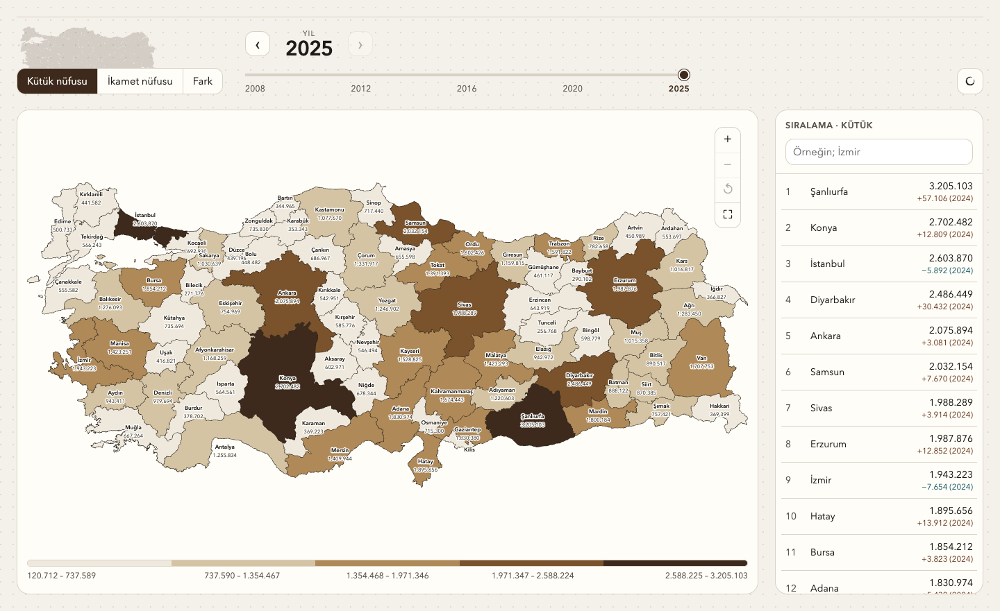

# Herkes kendi ilinde yaşasaydı



TÜİK Adrese Dayalı Nüfus Kayıt Sistemi verisiyle, herkes MERNİS’te aile kütüğünün kayıtlı olduğu ilde yaşasaydı 81 ilin nüfusunun nasıl görüneceğini gösteren statik bir harita.

Bu sayı doğum yeri değildir. Kütük nüfusu yalnızca Türkiye’de ikamet eden T.C. vatandaşlarını kapsar. İkamet nüfusu ADNKS il nüfusudur ve yabancı uyrukluları da içerir.

Yıl seçici 2008–2025’i kapsar. Kütük sayıları TÜİK Veri Portalı’ndaki “İkamet edilen ile göre nüfus kütüğüne kayıtlı olunan il, 2008-2025” zaman serisinden alınır. ADNKS 2007’de başladı; bu çapraz tablo 2008’den itibaren yayımlanıyor.

## Çalıştırma

```bash
npm install
npm run dev
```

## Veri

- `public/data/provinces.json` — yıllara göre il plaka kodu, kütük nüfusu, ikamet nüfusu
- `public/tr-provinces.geojson` — 81 il sınırı (plaka kodu `properties.number`), [geoBoundaries](https://www.geoboundaries.org/) ADM1 (CC BY 4.0), harita için sadeleştirildi

Kaynak: [TÜİK Veri Portalı](https://veriportali.tuik.gov.tr/tr), Adrese Dayalı Nüfus Kayıt Sistemi sonuçları. Kütük tablosu: ikamet edilen ile göre nüfus kütüğüne kayıtlı olunan il (2008–2025 zaman serisi). İkamet: ADNKS il nüfusu.

Yeni yıl verisi geldiğinde aynı tabloyu indirip `provinces.json` içine `series.<yıl>` olarak ekleyin. Eşleşme anahtarı plaka kodudur.

## Yayın

```bash
npm run build
```

`dist` klasörünü GitHub Pages veya herhangi bir statik host’a yükleyin. `vite.config.js` içindeki `base` değeri `./` olduğu için alt dizinde de çalışır.
